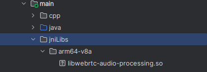

## 背景

经过上一篇的webrtc库的编译，我们有了编译好的webrtc库。这里我们讲一下如何使用webrtc库。

## 过程

通过之前下面的这几个命令，我们已经得到了编译好的webrtc库。 
```
meson . build -Dprefix=$PWD/install --cross-file=cross_android.txt
ninja -C build
ninja -C build install
```
在build目录下生成install目录，里面就是编译好的so文件。名称是libwebrtc-audio-processing-2.so。   
首先建立一个Android项目，在main目录右键New-> Folder-> JNI Folder。  
然后将libwebrtc-audio-processing-2.so文件拷贝到jniLibs目录下。  
　<font color='red'>注意：一定要在copy之前把so后面的-2去掉，否则会报错。这个问题查了好久，才发现的。</font>
  
然后我们发现使用库需要头文件，但是我们没有头文件。我们需要把webrtc库的文件夹直接拷贝到我们的项目中。
编辑下CMakeLists.txt文件，添加下面的代码。增加了头文件和库文件。
```
set(my_lib_path ${CMAKE_SOURCE_DIR}/../jniLibs)
add_library(webrtc-audio-processing SHARED IMPORTED)
set_target_properties(webrtc-audio-processing PROPERTIES IMPORTED_LOCATION
        ${my_lib_path}/${ANDROID_ABI}/libwebrtc-audio-processing.so)
include_directories(
        ./
        ./webrtc/
)
```
编译，正常出错，提示找不到absl库相关的文件。
去webrtc库的文件夹中找到absl库的文件夹，然后拷贝到我们的项目中。在根目录下的subprjects文件夹中。   
再编译，正常的话会通过。
  
补充: 运行时发现找不到libwebrtc-audio-processing-2.so，原因是我们把库改名了，再复制一个库，改名为libwebrtc-audio-processing-2.so，就可以了。
另外，还会找不到libc++_shared.so，在build.gradle文件中添加下面的代码。  
```
        externalNativeBuild {
            cmake {
                cppFlags ''
                arguments "-DANDROID_STL=c++_shared"
            }
        }
```

最后上链接：https://github.com/spmno/WebrtcTest

